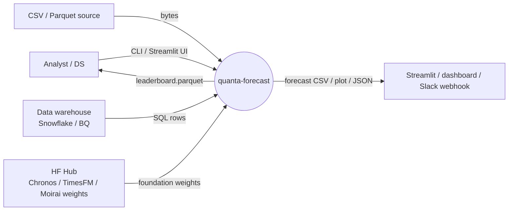
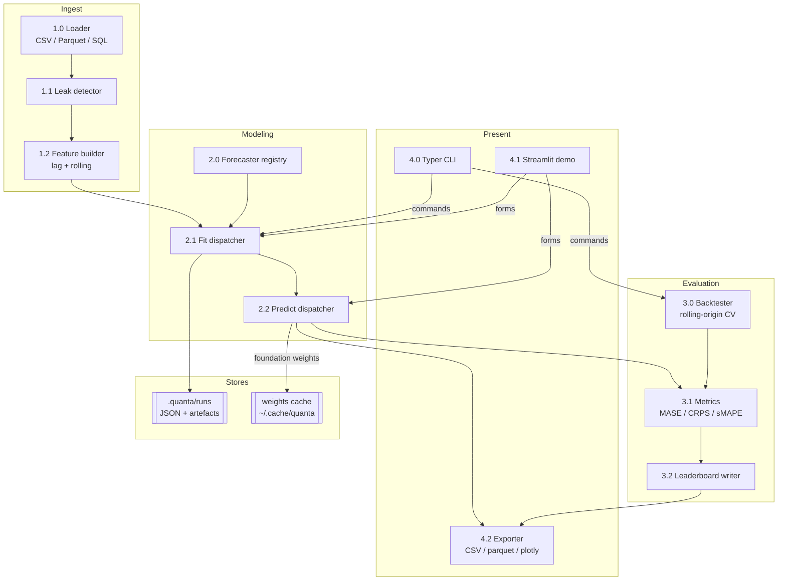
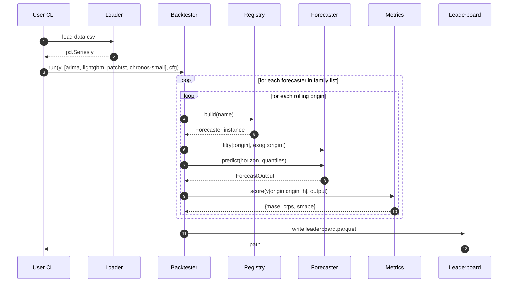
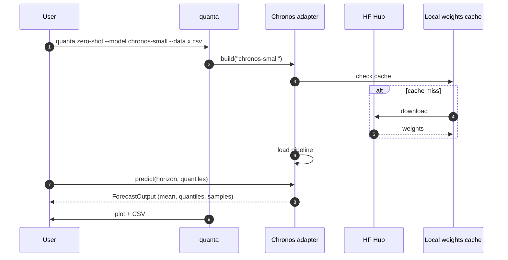

# DFD — quanta-forecast

## Level 0 — Context

## Level 1 — Functional decomposition

## Level 2 — `quanta bench` data flow

## Level 2 — Foundation-model zero-shot path

## Data stores

| Store | Purpose | Retention |
|-------|---------|-----------|
| `.quanta/runs/` | Per-run JSON (seed, versions, data-hash) + artefacts | 30 days (configurable) |
| `~/.cache/quanta/weights/` | Foundation-model weight cache | Until manually purged |
| `leaderboards/*.parquet` | Cross-family evaluation results | User-controlled |

## Invariants & contracts

- `ForecastOutput.quantiles.shape == (horizon, len(quantile_levels))`
- `ForecastOutput.quantiles` is **monotonic** along the quantile axis (asserted in validator).
- No feature column may depend on rows with `t > origin` in strict mode.
- Weight downloads are **content-addressed**: the cache key includes SHA of config + weights.

## Trust / sensitivity

- Data loaded from user sources never leaves the local process.
- Foundation weights downloaded from HF over HTTPS; checksums verified.
- Opt-in telemetry (off by default) reports only anonymised run metadata, never user data.
